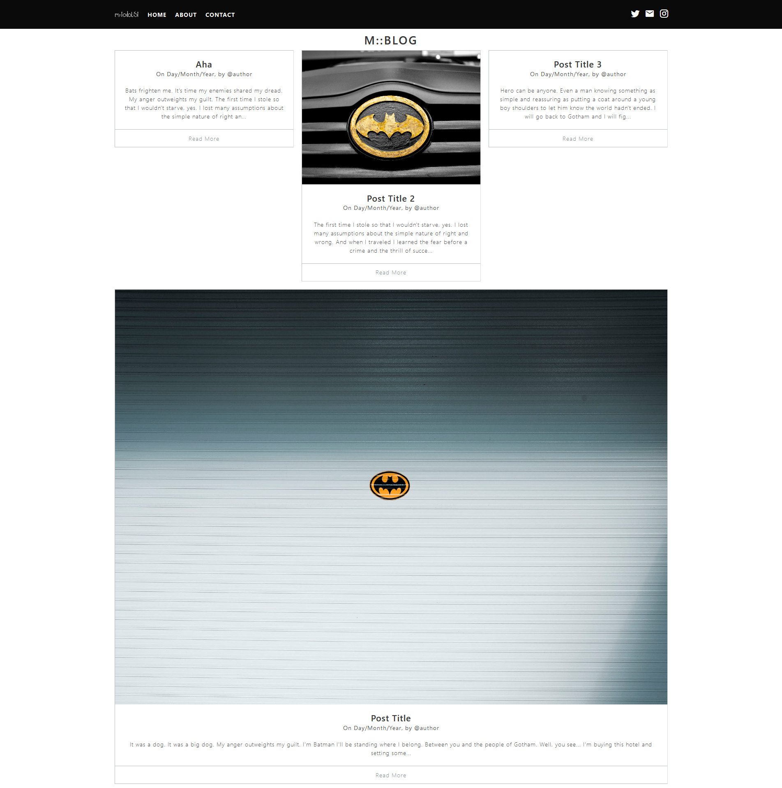

# m::Blog


A blazing fast ⚡ blog built with Vue.js (frontend) and Rocket.rs (backend).

## Pre-requisites
- Rust with nightly toolchain.
- Node.js (recommend version >= 12.x.x)

## Installing all depedencies
- Frontend:
```sh
cd client
npm run install
```

- Backend:
```sh
cd ..
cargo build
```

## Screenshots
<details>
<summary>Blog Home Page</summary>

</details>
<details>
<summary>Blog Post</summary>

</details>

## Running

### Development mode
If you want to customize your site or add new features use the both commands (on separeted terminals):
```sh
cd client
npm run dev
```
```sh
cd ..
cargo run
```
And then you can start adding new stuffs or editing what alredy exists!

### Production mode
Running on production mode let's you generate the client files and run the client and server only using Rocket.rs.
```sh
cd client
npm run generate

cd ..
cargo run
```

## Configuration
1. On the files:
```
pages/index.vue
pages/post/_slug.vue
```

You can see that it has the string `http://localhost:8000/` it is the server adress to search for the post images.

2. On the file `nuxt.config.js`, you can see:
```javascript
proxy: {
    '/api/': {
        target: 'http://localhost:8000/api/',
        pathRewrite: {
        '^/api/': ''
        },
        changeOrigin: true
    }
}
```
You will need to the same as for the above, change the server adress to the correct adress based on the rust server.

## Posts and pages
### Creating new posts
1. All posts are based on the file system and you can create a new post just adding a new folder on `blog/posts` with title of the blog post, like: `my-post-title`. Note that the `-` will be replace as a space on the site.
2. Add the file `content.md` with the post content.
3. You can add a image to the post inserting a file named as `image.jpg`.


### Creating new pages
1. The process os creating new pages is more simple, all you need to do is create a new markdown file in `blog/pages`, like `about.md` and insert the content of the page on the file.